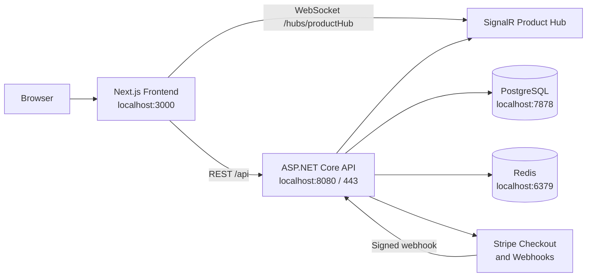

# SMA Architecture

## 1. System Overview

SMA is a full-stack ecommerce application composed of:

- A Next.js web frontend.
- An ASP.NET Core .NET 10 Web API.
- PostgreSQL for durable application data.
- Redis for distributed caching.
- SignalR for product updates in real time.
- Stripe Checkout and signed webhooks for payments.
- Docker Compose for local multi-service deployment.

PostgreSQL is the system of record. Redis improves read performance but is not required for data durability or correctness.



## 2. Repository Structure

```text
SMA/
├── docker-compose.yml
├── ARCHITECTURE.md
├── Backend/
│   ├── SMA.slnx
│   ├── SMA.API/
│   │   ├── Configuration/
│   │   ├── Controllers/
│   │   ├── Data/
│   │   ├── DTOs/
│   │   ├── Entities/
│   │   ├── Hubs/
│   │   ├── Migrations/
│   │   ├── Models/
│   │   ├── Services/
│   │   │   ├── ServiceContracts/
│   │   │   └── ServiceImplementation/
│   │   └── Utilities/
│   └── UserManagerConsole/
└── Frontend/
    └── sma-ui/
        ├── app/
        ├── Components/
        ├── DTOs/
        ├── Lib/
        ├── Store/
        ├── Utils/
        ├── Dockerfile
        └── next.config.ts
```

## 3. Runtime Topology

All services run on the default Docker Compose network and can reach one another by service name.

| Service | Container technology | Host address | Container address | Purpose |
|---|---|---|---|---|
| `frontend` | Next.js standalone image | `http://localhost:3000` | `frontend:3000` | Browser application |
| `api` | ASP.NET Core image | `http://localhost:8080` | `api:8080` | REST API, SignalR, Stripe webhook |
| `api` HTTPS | ASP.NET Core/Kestrel | `https://localhost:443` | `api:443` | HTTPS API endpoint |
| `db` | PostgreSQL 16 Alpine | `localhost:7878` | `db:5432` | Durable relational storage |
| `redis` | Redis 7 Alpine | `localhost:6379` | `redis:6379` | Distributed cache |

The frontend must use `http://localhost:8080/api` as `NEXT_PUBLIC_API_URL`. This value is embedded into the browser bundle during the frontend image build, so it must not use the internal Docker hostname `api`.

## 4. Docker Compose

The root [docker-compose.yml](docker-compose.yml) defines all application services.

### Startup dependencies

- PostgreSQL has a `pg_isready` healthcheck.
- Redis has a `redis-cli ping` healthcheck.
- The API waits for PostgreSQL and Redis to become healthy.
- The frontend waits for the API container to start.
- PostgreSQL data is stored in the named `postgres_data` volume.
- Redis is intentionally ephemeral and has no volume because it currently stores cache data only.

### Frontend image

[Frontend/sma-ui/Dockerfile](Frontend/sma-ui/Dockerfile) uses three stages:

1. `deps`: installs the locked npm dependencies with `npm ci`.
2. `builder`: builds Next.js with `NEXT_PUBLIC_API_URL`.
3. `runner`: runs the generated standalone server with Node.js.

[Frontend/sma-ui/next.config.ts](Frontend/sma-ui/next.config.ts) enables `output: "standalone"`, which keeps the production image smaller and avoids requiring the full development toolchain at runtime.

### Backend image

[Backend/SMA.API/Dockerfile](Backend/SMA.API/Dockerfile) builds and publishes the .NET API image. The API mounts the development HTTPS certificate from `Backend/SMA.API/certs`.

## 5. Backend Architecture

The backend is an ASP.NET Core Web API project targeting .NET 10.

### Application startup

[Backend/SMA.API/Program.cs](Backend/SMA.API/Program.cs) is the composition root. It:

- Loads the repository `.env` file when available.
- Configures PostgreSQL through Entity Framework Core and Npgsql.
- Configures Redis through `IDistributedCache` and StackExchange.Redis.
- Registers JWT authentication and authorization.
- Registers controllers, Swagger, CORS, SignalR, and health checks.
- Registers application services through interfaces and implementations.
- Applies pending EF Core migrations automatically in Development.
- Maps controllers, `/health`, and `/hubs/productHub`.

### Backend layers

| Layer | Location | Responsibility |
|---|---|---|
| HTTP/API | `Controllers/` | Routing, authorization, request handling, response status codes |
| Contracts | `Services/ServiceContracts/` | Service and cache interfaces |
| Application services | `Services/ServiceImplementation/` | Business rules and orchestration |
| Data access | `Data/AppDbContext.cs` | EF Core database context and mappings |
| Domain model | `Entities/` | Persistent entities and relationships |
| API models | `DTOs/` and `Models/` | Request and response contracts |
| Configuration | `Configuration/` | JWT, Swagger, and Stripe setup |
| Real time | `Hubs/` | SignalR hub methods |
| Utilities | `Utilities/` | Shared helpers such as password hashing |

### Main API areas

Authentication:

- `POST /api/auth/register`
- `POST /api/auth/login`
- `POST /api/auth/refresh`
- `POST /api/auth/revoke`

Products:

- `GET /api/products`
- `GET /api/admin/products`
- `POST /api/admin/products`
- `PUT /api/admin/products/{id}`
- `PATCH /api/admin/products/{id}/stock`

Orders:

- `POST /api/orders/checkout`
- `GET /api/orders`
- `GET /api/orders/{id}`
- `GET /api/admin/orders`

Payments and operations:

- `POST /api/stripe/webhook`
- `GET /health`
- SignalR hub: `/hubs/productHub`

## 6. Data Architecture

[AppDbContext.cs](Backend/SMA.API/Data/AppDbContext.cs) manages the following primary tables:

- `Users`
- `RefreshTokens`
- `Products`
- `Inventory`
- `Orders`
- `OrderItems`
- `Transactions`
- `StripeWebhookEvents`

Key relationships:

- A user has many orders.
- A product has one inventory record.
- An order has many order items.
- An order has many transactions.
- A user has many refresh tokens.
- Product inventory is linked to order items through the product relationship.

EF Core migrations are stored under `Backend/SMA.API/Migrations`. In Development, the API applies pending migrations during startup.

## 7. Authentication and Authorization

The API uses JWT bearer authentication.

1. A user registers or logs in through `AuthController`.
2. `AuthService` verifies credentials and creates tokens through `TokenService`.
3. The access token contains user identity, email, role, and tenant claims.
4. The frontend stores client authentication state in Zustand/local storage.
5. Axios adds the access token as a Bearer token to API requests.
6. `AuthGuard` protects shop routes and `AdminGuard` protects admin routes.
7. Admin endpoints use role-based authorization.

Refresh tokens are hashed with SHA-256 before storage in PostgreSQL. The raw refresh token is returned to the client for token refresh and revocation workflows.

## 8. Redis Caching

Redis is registered as the ASP.NET Core `IDistributedCache` implementation.

[ProductCache.cs](Backend/SMA.API/Services/ServiceImplementation/ProductCache.cs) implements cache-aside behavior for product reads:

- Active customer products: `sma:products:active:v1`
- Admin products: `sma:products:admin:v1`
- Cache lifetime: two minutes
- Serialization: `System.Text.Json` using web defaults

Read flow:

1. `ProductService` asks Redis for the requested product list.
2. On a hit, the cached DTO list is returned without a PostgreSQL query.
3. On a miss, the service queries PostgreSQL, maps entities to DTOs, and writes the result to Redis.
4. If Redis is unavailable, the service logs a warning and falls back to PostgreSQL.

Both product cache entries are invalidated after:

- Product creation.
- Product updates.
- Stock updates.
- Checkout stock reservation.
- Successful Stripe payment processing.
- Failed or expired Stripe checkout processing.

Redis is an optimization layer. PostgreSQL remains authoritative for stock, orders, payments, and user data.

## 9. Product and Inventory Flow

Product availability is read from `Products` and `Inventory` and exposed through product DTOs.

During checkout:

1. The API receives product IDs, quantities, and shipping details.
2. `OrderService` opens a PostgreSQL transaction.
3. Products and inventory are re-read from PostgreSQL.
4. Availability is validated authoritatively.
5. Available stock is decreased and reserved stock is increased.
6. An order is created with a pending payment state.
7. Stripe creates a Checkout Session.
8. The session ID is stored and the transaction commits.
9. The product cache is invalidated.

The frontend then redirects the customer to Stripe Checkout.

## 10. Stripe Payment Flow

The Stripe integration has two parts:

- `StripePaymentService` creates hosted Checkout Sessions.
- `StripeWebhookService` processes signed Stripe events.

The webhook endpoint accepts anonymous requests but verifies the `Stripe-Signature` header against the configured webhook secret.

Supported event categories include:

- Checkout completed.
- Asynchronous payment succeeded.
- Asynchronous payment failed.
- Checkout expired.
- Payment requiring customer action.

Webhook event IDs are stored in `StripeWebhookEvents` to prevent duplicate processing. Successful payment releases reserved stock from the reservation count. Failed or expired payments restore available stock and release the reservation. Product cache entries are invalidated after inventory changes.

## 11. SignalR Real-Time Updates

[ProductHub.cs](Backend/SMA.API/Hubs/ProductHub.cs) exposes product group membership methods.

The frontend hook [useProductHub.ts](Frontend/sma-ui/Lib/signalR/useProductHub.ts):

- Connects to `/hubs/productHub`.
- Enables automatic reconnect.
- Joins the `products` group.
- Handles `ProductUpdated` events.

`ProductService` publishes updates to the product-specific group and the global `products` group after admin product or stock changes.

There is currently no Redis SignalR backplane. This means broadcasts are process-local if the API is later scaled to multiple instances. Redis is currently used only for application caching.

## 12. Frontend Architecture

The frontend is a Next.js 16 App Router application using React 19 and TypeScript.

### Main responsibilities

- Render shop and admin pages.
- Manage authentication state in Zustand.
- Manage the client-side shopping cart in Zustand/local storage.
- Call backend endpoints through Axios modules.
- Redirect customers to Stripe Checkout.
- Subscribe to product updates through SignalR.

### Important frontend modules

| Location | Responsibility |
|---|---|
| `app/` | App Router pages, layouts, and route groups |
| `Components/` | Shared UI and authentication guards |
| `Lib/api/api.ts` | Axios client and authorization interceptor |
| `Lib/AuthApis.ts` | Authentication API calls |
| `Lib/ProductApis.ts` | Product API calls |
| `Lib/OrderApis.ts` | Order API calls |
| `Lib/signalR/useProductHub.ts` | SignalR product updates |
| `Store/authStore.ts` | Access token and user state |
| `Store/cartStore.ts` | Persisted shopping cart |
| `DTOs/` | Frontend request and response types |

Shop routes are grouped under `app/(shop)` and include the home page, cart, checkout, and customer orders. Admin routes are under `app/admin`.

The browser uses the API URL embedded at build time through `NEXT_PUBLIC_API_URL`. SignalR derives its hub URL from the same value by removing the `/api` suffix.

## 13. Configuration

Docker Compose reads sensitive values from the root `.env` file. The repository should not commit secrets.

Important API settings:

| Setting | Docker value | Purpose |
|---|---|---|
| `ConnectionStrings__DefaultConnection` | `Host=db;Port=5432;...` | PostgreSQL connection |
| `ConnectionStrings__Redis` | `redis:6379` | Redis connection |
| `NEXT_PUBLIC_API_URL` | `http://localhost:8080/api` | Browser API base URL |
| `Stripe__SecretKey` | From `.env` | Stripe API authentication |
| `Stripe__WebhookSecret` | From `.env` | Stripe webhook verification |
| `Stripe__SuccessUrl` | Frontend URL | Successful checkout redirect |
| `Stripe__CancelUrl` | Frontend URL | Cancelled checkout redirect |

For local non-Docker API execution, PostgreSQL is reachable at `localhost:7878` and Redis at `localhost:6379`.

## 14. Local Docker Operations

Start or rebuild the complete stack:

```bash
docker compose up -d --build
```

View service status:

```bash
docker compose ps
```

Validate the Compose file:

```bash
docker compose config
```

Verify health and data services:

```bash
curl.exe http://localhost:8080/health
docker compose exec redis redis-cli ping
docker compose exec db pg_isready -U postgres -d sma
```

Stop the stack without removing the PostgreSQL volume:

```bash
docker compose down
```

To remove the PostgreSQL data volume as well, use this intentionally destructive command:

```bash
docker compose down -v
```

## 15. Architectural Considerations

- Redis failures currently degrade to PostgreSQL reads, which preserves correctness but reduces performance.
- Cache invalidation is separate from the database transaction, so the two-minute TTL is a final stale-data safety net.
- Product cache keys are versioned and separate for customer and admin DTO shapes.
- The current SignalR setup is suitable for one API instance. A multi-instance deployment needs a backplane or another distributed messaging strategy.
- The frontend API URL is a build-time value. Changing the public API host requires rebuilding the frontend image.
- The current Compose environment is development-oriented. Production deployment should add secret management, HTTPS certificate management, Redis authentication/TLS, resource limits, and explicit observability.
- There is no automated test project currently visible in the repository; build, Compose validation, service health checks, and endpoint checks are the current verification mechanisms.
